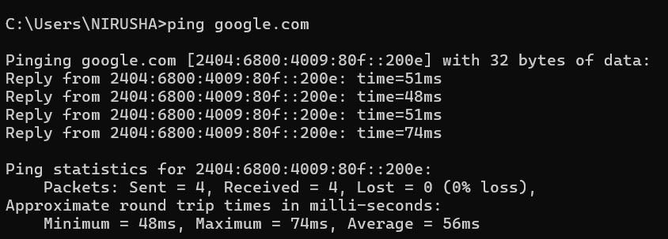
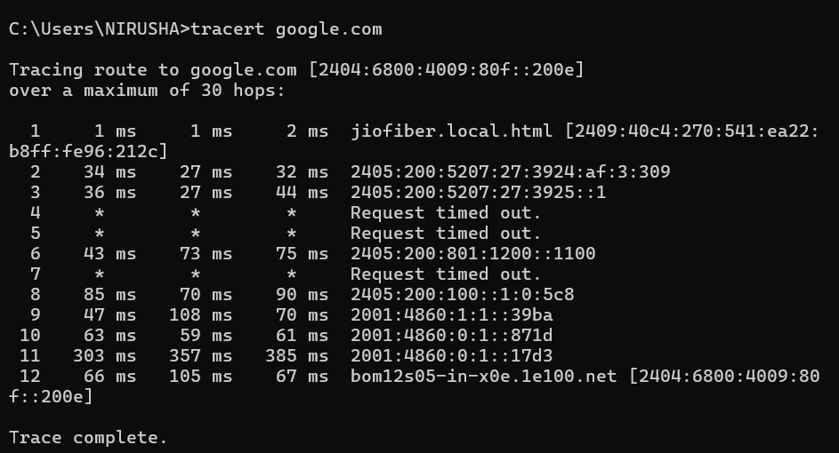

NETWORKING TASK - 1 

* Objective : To understand the network environment of our device  as well as basic components of network 
 
Part A : Network Information 
1. Hostname - LAPTOP-PTK8S7VG

2. IPv4 Address - 192.168.31.115

3. MAC Address - A8-E2-91-XX-XX-XX

4. Default Gateway - 192.168.31.1

5. DNS Server - 192.168.31.1

Part B : Basic Networking Concepts 

* IP Address - It is a logical address of a device on a network 
* MAC Address - It is a physical Address of a device 
* Default Gateway - It is a device that connects our local network with other networks . It is like a door of a house  which needs to be passed to reach the destination . 
* DNS - It is a domain name system that convert a website name into IP address

Part C : Basic Network Diagram 

[You cn find the diagram of network flow in screeshot folder as well as diagram foolder]

Part D : Network Connectivity Test

The commands we used are as follows 

1. ipconfig  

2. ping google.com  

3. tracert 

Conclusion : This task helped me understand the key network concepts such as IP addressing , DNS , MAC addressing and default gateway. 
These components are essential for network communication and Internet connectivity . I also understood the concept of hop . 

