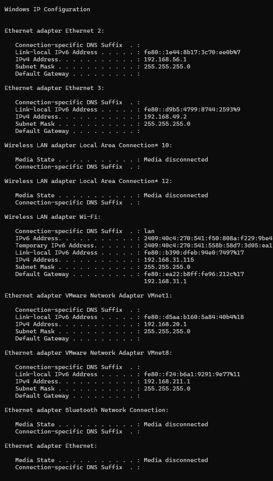
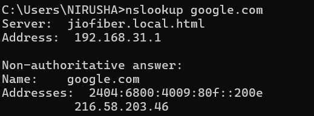

Networking Task 02 : Network Devices & IP Addressing 

* Objective : To understand common network devices , IP addressing concepts and how data travels through network

I) Network Devices 

1. Router - It connects different networks and it helps to receive and send the data packets to the correct network using IP addresses .
2. Switch - It connects devices within the same network . It uses MAC addresses to send data only to intended device 
3. Hub - It connects multiple devices in a network and broadcast incoming data to all intended devices 
4. Access Point - It helps to provide wireless connectivity to devices and converts network signals into wi-fi signals
5. Firewall - It protects network from unauthorized access and monitors as well as filter incoming and outgoing network traffic .
Moderm - It is uses to connects a network to an internet service provider .

II)  IP Addess Classification 

IP Address is classified as Private and Public IP

These can be differencitae as follows :

- Private IP address are generally in 10.0.0 , 192.168.0.0 , 172.16.0.0 
- Public IP address are which is not private IP address or these are generally in random different from private IP such as 8.8.8 , 1.1.1 

III) Understanding your device 

- IPv4 address : 192.168.31.115
- Default gateway : 19.168.31.1
- DNS server : 192.168.31.1

[The screenshots are available in Networking_Task_2_T Nirusha/Answers]

IV) Network Communication follows

[the diagram of the network communication flow in under  Networking_Task_2_T Nirusha/diagram]

V) Commands 

- ipconfig/all 

- ping google.com

- nslookup google.com

